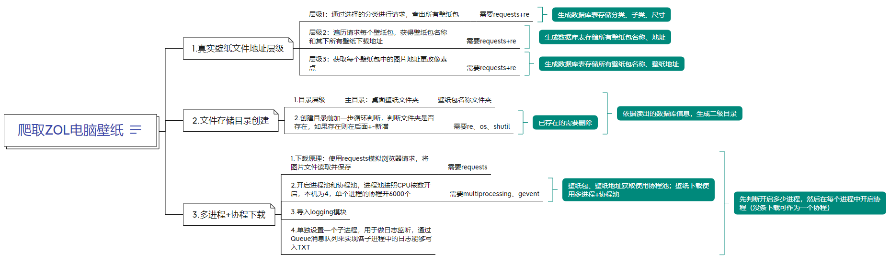

## ----爬取ZOL电脑壁纸

----本程序设置了默认下载该地址下的所有壁纸：https://desk.zol.com.cn/2560x1440/

----壁纸包地址获取与壁纸下载采用了多进程+协程池的方式

#### 一.功能注解

1.爬取ZOL桌面壁纸，地址：https://desk.zol.com.cn/；

2.分析爬取到的壁纸分类、壁纸子类、壁纸尺寸信息，获取到所有壁纸包信息（名称、url），并将这些信息分开存储到数据表中；

3.再次爬取所有壁纸包地址，获取到壁纸包下的所有图片地址，保存到数据表中；

4.直接读取数据表中保存的所有壁纸的信息（名称、URL）进行壁纸下载，壁纸按照壁纸包的不同分不同文件夹；

#### 二.代码设计流程

1.真实壁纸文件地址层级

    层级1：通过选择的分类进行请求，查出所有壁纸包 需要requests+re
    层级2：遍历请求所有壁纸包，获得壁纸包名称和其下所有壁纸下载地址 需要requests+re
    层级3：获取所有壁纸包中的图片地址更改像素点 需要requests+re

2.文件存储目录创建

（1)目录层级 主目录：桌面壁纸文件夹 壁纸包名称文件夹

（2)创建目录前加一步循环判断，判断文件夹是否存在，如果存在则在后面+-新增

    需要re、os、shutil 

（3)多进程+协程下载

    1)下载原理：使用requests模拟浏览器请求，将图片文件读取并保存 需要requests 
    2)开启进程和协程池，进程按照CPU核数开启，本机为4，单个进程的协程开6000个
    3)需要multiprocessing、gevent

（4）日志记录

    1）使用了logging模块，记录了脚本运行中的关键日志，保存只TXT文件中；
    2）多进程中子进程的日志通过消息队列传递给监听进程，由监听进程写入日志文件。

#### 三.数据库表相关

1.MySQL

    （1）版本：mysql-8.0.26 
    （2）工具：Navicat Premium15

2.数据库：

    数据库名：wallpaper

3.数据表：

    （1）分类表：categories 
    （2）尺寸表：size 
    （3）子类表：subtype
    （4）壁纸包表：wallpaper_package 
    （5）壁纸地址表：wallpaper_address 
    ----建表语句见data_processing.py文件中create_table方法的sql_list列表

#### 四.代码执行

1.执行初始化SQL文件

    initialize.sql；

2.运行main.py文件

    其中获取下载路径与下载壁纸文件已完全解耦，即data_processing.py、downloader.py文件可分别执行 ----Python版本及相关第三方包版本请参考代码中的标识